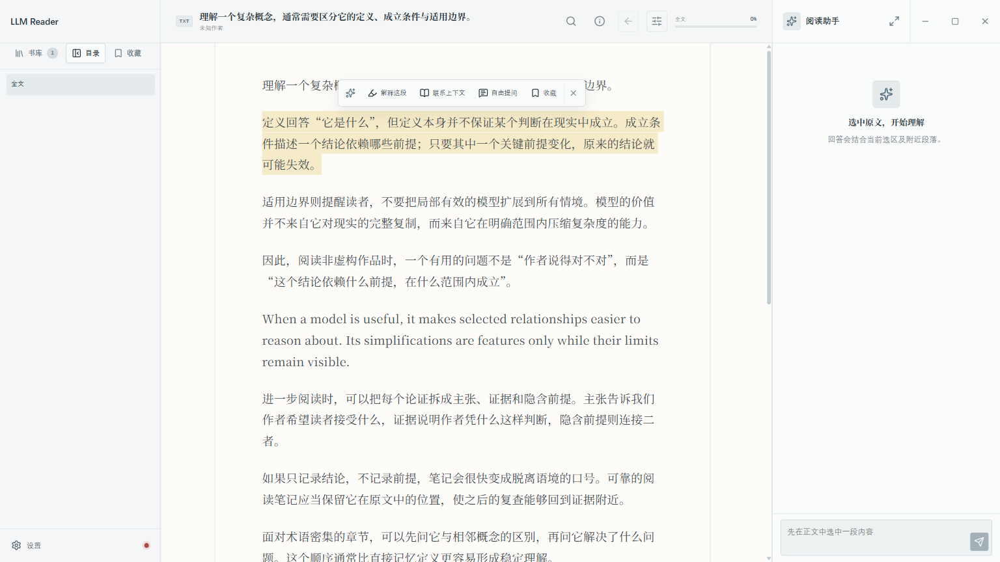

<p align="center">
  
</p>

<h1 align="center">LLM Reader</h1>

<p align="center">本地优先、以 LLM 辅助理解复杂非虚构内容为核心的 Windows 桌面阅读器。</p>

<p align="center">
  <a href="https://github.com/maaoding/llm-reader/releases/latest">下载最新版本</a>
  ·
  <a href="https://llm-reader.maaoding.icu/">项目主页</a>
</p>

<p align="center">
  
</p>

## 功能

### 书库与阅读

- 支持导入无 DRM 的 EPUB、UTF-8 TXT 或 PDF；本机已安装 Calibre 时，还可将无 DRM 的 MOBI/AZW3 转换为 EPUB 后导入。
- 支持文件多选与整窗拖拽批量导入（最多 300 个）：逐本顺序处理、单项失败不中断批次，可随时取消，完成后显示汇总；单文件上限为 250 MB，其中 TXT 为 64 MB。
- 导入文件复制到应用数据目录并按 SHA-256 去重，重复导入会直接打开已有书籍。
- 左侧提供书库、可折叠的层级目录和本书句段收藏三个视图；EPUB 书籍显示封面（大书库按可见范围懒加载），并可打开书籍信息查看格式、文件大小、语言、出版社、出版日期、简介等元数据。
- 书籍详情页支持删除书籍；删除会同时清理本地书籍文件、封面缓存、句段收藏与归档回答，且无法恢复。
- 连续滚动阅读并恢复上次自然阅读位置；目录、句段收藏与回答内引用的跳转不会覆盖该位置。PDF 以连续页方式阅读，支持适合宽度、缩放、页码进度与单页文字选择。
- 支持在本书内全文搜索，命中可逐个跳转且不破坏自然阅读位置。
- 标题栏显示当前章节与本章阅读进度；阅读区提供随界面明暗切换的默认、护眼纸张主题。
- 阅读设置可调整正文字号（80%–140%）、系统字体、行间距、首行缩进、正文宽度、段落间距与对齐。

### 划词与助手

- 选中原文后可“解释这段”“联系上下文”“自由提问”或“收藏”；前三种操作的名称、图标与固定提示词可在设置中自定义。
- 句段收藏在原文持久高亮，可从左侧“收藏”栏跳回原文。
- 原文未准备时，应用把选区与最多 6,000 个 Unicode 字符的当前章节上下文发送给用户配置的 `/v1/chat/completions` 兼容接口。
- 在阅读助手的“原文与章节笔记”中先“准备原文”；EPUB/TXT 在本机完成，无需分析模型。原文可检索后即可全书问答，也可另行选择模型“生成章节笔记”，整理概念与全书概要。两步分别支持暂停、续跑和重建，退出后不自动继续接口调用。
- 分析进度区分分节分析、章节汇总和全书合并。临时请求错误或结果校验失败时，每步最多尝试 3 次，重试可能消耗额度；失败记录保留最近 10 条，续跑复用已完成的分节、章节及中间汇总。
- 原文准备完成后，“本段”问答可结合全文与已完成的笔记，“全书”问答无需选区。笔记未开始、部分完成、失败或暂停均不阻断已准备原文。各轮通过本地全文检索和最多一次模型规划取材，原文、笔记与近期历史共用输入预算；来源区分别显示实际原文证据和笔记覆盖。
- 设置 → **知识处理**可单独配置 Embedding 接口与模型。原文就绪后，在书籍的“语义索引”中手动建立索引，无需章节笔记；向量保存在本机 SQLite。启用后，问题会用于书内混合检索，以改善同义问法的取材；接口失败自动回退全文检索。支持暂停、续跑和重建，不自动安装模型或数据库。
- PDF 准备可接入 **MinerU 本地服务／MinerU 云服务／Docling Serve**，只要求文档服务配置，支持 OCR 与语言选择。开始前说明整份文件将上传；保留章节树、表格、脚注、公式和多页来源，解析提示集中于“文档检查”。来源可逐页跳回原 PDF 核对，没有行级页码时明确标为整表范围。处理文字不替换原 PDF。详见[知识处理说明](docs/knowledge-processing.md)与[文档结构验收](docs/document-structure-validation.md)。
- 回答流式显示，支持停止生成与追问；引用可跳回原文，不在本次上下文中的引用会标记为未验证。
- 有价值的回答可手动归档为本地会话；放大按钮打开助手工作台，工作台内可在“对话”与“归档”之间切换，跨书查看全部归档并继续追问、保留历史与原文位置。
- 归档支持按书名、作者、引用或回答搜索，并可导出全部、当前书籍或单条归档为 Markdown。

### 设置与安全

- 界面主题支持浅色、深色与跟随系统，界面缩放可选 90%、100%、110%、125%。
- 模型设置支持保存多套命名配置并随时切换，可从接口拉取模型列表辅助填写；保存后可测试连接，设置入口显示 API 连接状态。
- 应用支持自动更新：打开设置时自动检查，也可手动检查；发现新版本会展示更新日志摘要，确认后下载并重启完成安装。更新经 GitHub Releases 分发，安装前校验更新包完整性。
- 书籍、自然阅读位置、句段收藏、回答归档（含追问历史）与模型设置保存在本机 SQLite（`node:sqlite`）。
- API Key 由 Electron `safeStorage` 加密：问答模型凭据保存在独立密文文件，知识处理凭据以密文保存在 SQLite；明文均不进入日志、数据库或渲染进程持久状态。
- Renderer 保持 `sandbox: true`、`contextIsolation: true`、`nodeIntegration: false`；窗口创建、导航、权限请求和外部网络请求均被拒绝，EPUB 内容按不可信输入处理。

## 安装

- 在 [GitHub Releases](https://github.com/maaoding/llm-reader/releases/latest) 下载最新的 `LLM Reader-x.y.z-setup.exe`。
- 安装程序支持选择安装目录，并创建桌面与开始菜单快捷方式；当前安装包未签名，Windows 可能显示安全提示。
- 如需导入 MOBI/AZW3，请先在系统中安装 [Calibre](https://calibre-ebook.com/)。

## 开发

```powershell
pnpm install
pnpm dev
```

开发环境需要 Node.js 24+ 与 pnpm 11+。

重装依赖后若 `pnpm dev` 报 `Error: Electron uninstall`，是 Electron 二进制的 postinstall 下载未执行，手动运行 `node node_modules\electron\install.js` 即可。

首次使用时在左侧栏底部打开“设置”，填写 Base URL、API Key 和 model。应用会请求该地址下的 `/v1/chat/completions`；远程接口必须使用 HTTPS，仅 `localhost`、`127.0.0.1` 与 `::1` 允许 HTTP。

“请求适配”默认为“自动”，会识别 OpenCode Go 官方地址（如 `https://opencode.ai/zen/go/v1`）。通过中转调用 Go 时，选择“OpenCode Go”；测试连接和获取模型列表会直接使用当前表单选项。中转需透传会话标识；Go 请求遇到重定向时，请填写最终接口地址。此选项仅适配请求头，仍需选择支持 `/v1/chat/completions` 的模型。

应用以 `LLM-Reader/<实际版本>` 标识客户端；Go 请求使用随机 UUID 作为 `x-opencode-session`。追问、规划和重试复用对话 ID，归档重开保留该 ID；章节分析单独维护 ID，暂停和续跑保持不变，重新分析时更换。旧配置、归档和分析缓存自动迁移，无需重新分析已有书籍。详见 [Go 兼容验证记录](docs/go-compatibility-validation.md)。

## 验证

```powershell
pnpm lint
pnpm typecheck
pnpm test
pnpm test:e2e
pnpm test:all
pnpm build:win
```

`pnpm test:e2e` 会先执行文案校验和应用构建，再运行 Playwright；`pnpm test:all` 依次执行 lint、typecheck、完整单元测试、应用构建与 Playwright，避免重复运行文案测试。`pnpm build:win` 会在 `release/` 生成未签名的 Windows x64 NSIS 安装包，以及自动更新所需的 `latest.yml` 元数据；更新源在 `electron-builder.yml` 的 `publish` 中配置为 GitHub Releases。

验收已安装版本时，将 `LLM_READER_E2E_EXECUTABLE` 指向安装目录中的 `LLM Reader.exe`，再运行 `pnpm test:e2e:run`。测试仍会为每个用例创建并清理隔离的临时用户数据目录，不会读写日常书库。

需要使用日常设置中已保存的真实兼容 API 做发布前冒烟时，运行 `pnpm test:real-api`。该命令不会加入 `test:all`，只在主动运行时发送少量合成测试内容；它会把 Base URL、model、`safeStorage` 加密后的密钥文件及其本机加密上下文复制到临时用户数据目录，不输出或修改密钥，也不复制日常书库，并在结束后清理测试数据。

全书理解质量对照先运行 `pnpm build:app`，再运行 `pnpm eval:book-context` 检查样本与模型配置；此时不会调用模型。显式执行 `pnpm eval:book-context --run` 后，会发送约 9,000 字的合成书籍，并用同一配置比较六道固定问题在旧局部上下文与全书增强模式下的回答。默认使用当前配置，可通过 `LLM_READER_REAL_API_PROFILE_ID` 指定另一已有配置。报告写入 `tmp/book-context-eval-*/`，逐轮保留实际来源、回答、引用与接口返回的用量；程序检查证据召回，回答含义仍需人工复核。详见 [全书上下文验证记录](docs/book-context-validation.md)。

## 许可证

LLM Reader 依据 [GPL-3.0-or-later](https://spdx.org/licenses/GPL-3.0-or-later.html) 发布。

Copyright (C) 2026 wrh37

完整条款见 `LICENSE`；第三方组件许可见 `THIRD_PARTY_NOTICES.md`。

源码仓库：https://github.com/maaoding/llm-reader

产品边界见 `PRODUCT.md`。
