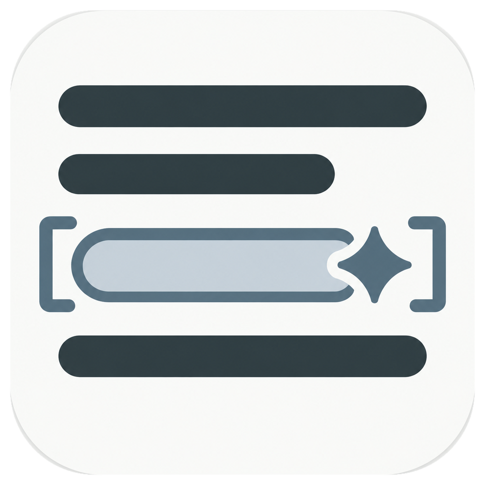

<p align="center">
  
</p>

<h1 align="center">LLM Reader</h1>

<p align="center">本地优先、以 LLM 辅助理解复杂非虚构内容为核心的 Windows 桌面阅读器（当前版本 0.3.0）。</p>

<p align="center">项目主页：<a href="https://llm-reader.maaoding.icu/">https://llm-reader.maaoding.icu/</a></p>

## 当前状态

### 书库与阅读

- 导入无 DRM 的 EPUB 或 UTF-8 TXT；文件复制到应用数据目录并按 SHA-256 去重，重复导入会直接打开已有书籍。单文件导入上限为 250 MB，其中 TXT 为 64 MB。
- 左侧提供书库、可折叠的层级目录和本书句段收藏三个视图；EPUB 书籍显示封面，并可打开书籍信息查看格式、文件大小、语言、出版社、出版日期、简介等元数据。
- 连续滚动阅读并恢复上次自然阅读位置；目录、句段收藏与回答内引用的跳转不会覆盖该位置。
- 标题栏显示当前章节与本章阅读进度；阅读区提供独立于界面主题的浅色、米黄、深色纸张主题。
- 阅读设置可调整正文字号（80%–140%）、系统字体、行间距、首行缩进、正文宽度与段落间距。

### 划词与助手

- 选中原文后可“解释这段”“联系上下文”“自由提问”或“收藏”；前三种操作的名称、图标与固定提示词可在设置中自定义。
- 句段收藏在原文持久高亮，可从左侧“收藏”栏跳回原文。
- 应用把选区与最多 6,000 个 Unicode 字符的当前章节上下文发送给用户配置的 `/v1/chat/completions` 兼容接口；追问时还会附带裁剪后的近期对话历史。
- 回答流式显示，支持停止生成与追问；引用可跳回原文，不在本次上下文中的引用会标记为未验证。
- 有价值的回答可手动归档为本地会话；归档可在大号对话页继续追问并保留历史，同时保留对应原文位置。

### 设置与安全

- 界面主题支持浅色、深色与跟随系统，界面缩放可选 90%、100%、110%、125%。
- 模型设置支持保存后测试连接，并在设置入口显示 API 连接状态。
- 书籍、自然阅读位置、句段收藏、回答归档（含追问历史）与模型设置保存在本机 SQLite（`node:sqlite`）。
- API Key 由 Electron `safeStorage` 加密后写入独立密文文件，不进入 SQLite、日志或渲染进程持久状态。
- Renderer 保持 `sandbox: true`、`contextIsolation: true`、`nodeIntegration: false`；窗口创建、导航、权限请求和外部网络请求均被拒绝，EPUB 内容按不可信输入处理。

## 开发

```powershell
pnpm install
pnpm dev
```

开发环境需要 Node.js 24+ 与 pnpm 11+。

首次使用时在左侧栏底部打开“设置”，填写 Base URL、API Key 和 model。应用会请求该地址下的 `/v1/chat/completions`；远程接口必须使用 HTTPS，仅 `localhost`、`127.0.0.1` 与 `::1` 允许 HTTP。

## 验证

```powershell
pnpm lint
pnpm typecheck
pnpm test
pnpm test:e2e
pnpm test:all
pnpm build:win
```

`pnpm test:e2e` 会先构建应用再运行 Playwright；`pnpm test:all` 依次执行 lint、typecheck、test 与 test:e2e。`pnpm build:win` 会在 `release/` 生成未签名的 Windows x64 NSIS 安装包。

## 许可证

LLM Reader 依据 [GPL-3.0-or-later](https://spdx.org/licenses/GPL-3.0-or-later.html) 发布。

Copyright (C) 2026 wrh37

完整条款见 `LICENSE`；第三方组件许可见 `THIRD_PARTY_NOTICES.md`。

源码仓库：https://github.com/maaoding/llm-reader

产品边界见 `PRODUCT.md`。
